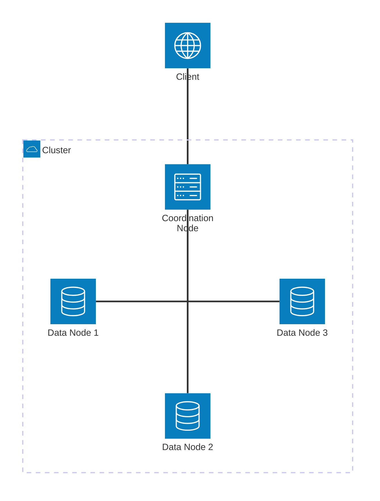
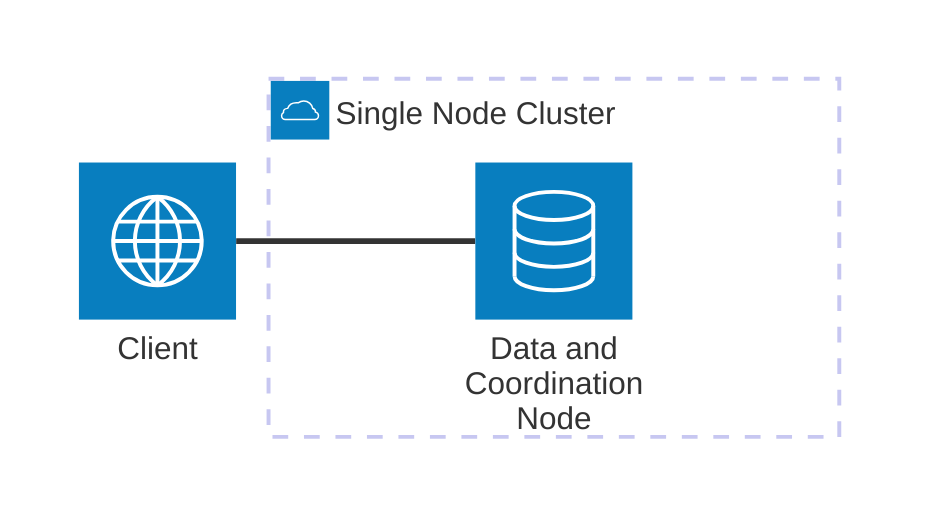

# ElasticDuck

[](https://deepwiki.com/michelcaradec/elasticduck)

<details>
<summary>Table of contents</summary>

- [Abstract](#abstract)
  - [Motivations](#motivations)
  - [Conventions](#conventions)
- [Project Setup](#project-setup)
  - [Requirements](#requirements)
  - [Configuration](#configuration)
- [Usage](#usage)
- [What Was Learned](#what-was-learned)
  - [Query Execution](#query-execution)
  - [Miscellaneous](#miscellaneous)
- [How Does It Work](#how-does-it-work)
  - [Components](#components)
  - [Cluster Definition](#cluster-definition)
  - [Node Initialization](#node-initialization)
  - [Cluster Initialization](#cluster-initialization)
- [Annexes](#annexes)
  - [Using A Bigger Data Set](#using-a-bigger-data-set)

</details>

## Abstract

A Proof of Concept On [DuckDB](https://duckdb.org/) and [Quack remote protocol](https://duckdb.org/docs/current/quack/overview).

### Motivations

As a user (and fan) of DuckDB, I got immediately excited (and curious) when the Quack remote protocol was [announced](https://duckdb.org/2026/05/12/quack-remote-protocol) on 2026-05-12.

Watching a [video](https://www.youtube.com/watch?v=L_lttD-d1wc) and reading some documentation is good (especially when it has this level of quality), but using the technology in the scope of a "hands-on" project is even better to fully understand its highlights and limitations.

So came the idea of quickly setting-up a **local DuckDB cluster**, based on nodes with different roles, all used by a client one (being a daily user of [Elasticsearch](https://www.elastic.co/elasticsearch), I will not make big mystery on where I took the inspiration from).

The name of the project ("ElasticDuck") was already in my head.  
I then had to [implement](#how-does-it-work) it, driven by few guidelines:

- Keep things as simple as possible (this is a proof of concept).
- Use minimum [requirements](#requirements).
- Learn new things.
- Have fun.

> [!NOTE]
> While the Quack protocol allows multiple DuckDB instances to read from and write to each other, this proof of concept **will focus on the read part**.

### Conventions

Every time an information of importance is to be provided, it will be shown this way:

> [!IMPORTANT]
> **Fact #xxx**  
> *The information.*

## Project Setup

### Requirements

```bash
# Install DuckDB
# https://duckdb.org/
curl https://install.duckdb.org | sh

# Install JQ
# https://jqlang.org/
sudo apt-get install jq

# Install MiniJinja
# https://github.com/mitsuhiko/minijinja
curl -sSfL https://github.com/mitsuhiko/minijinja/releases/latest/download/minijinja-cli-installer.sh | sh

# Install uv (optional)
curl -LsSf https://astral.sh/uv/install.sh | sh
source $HOME/.local/bin/env

# Install mitmproxy (optional)
# https://www.mitmproxy.org/
uv tool install mitmproxy
uv tool update-shell
```

### Configuration

1. Copy the file [scripts/.env.default](./scripts/.env.default) to [scripts/.env](./scripts/.env), and set the environment variables:

    - `DRY_RUN`: `1` to dump the SQL scripts sent to DuckDB (no actions will be taken).
    - `HTTP_PROXY`: the URL of a "man in the middle" proxy, to intercept requests sent between DuckDB instances (use `http://localhost:8080` with [mitmproxy](https://www.mitmproxy.org/)).

## Usage

1. Optional: Start the "man in the middle" proxy:

    ```bash
    mitmproxy
    ```

> [!NOTE]
> This step is only required if the environment variable `HTTP_PROXY` is [set](#configuration) in the file [scripts/.env](./scripts/.env).

> [!TIP]
> The traffic between the nodes can also be observed with the command:
>
> ```bash
> sudo tcpdump --interface lo tcp portrange 9494-9498
> ```

2. Start the ElasticDuck cluster:

    ```bash
    bash ./scripts/cluster_up.sh ./config/cluster.jsonc
    ```

3. In the DuckDB (interactive) client node session, run few queries.

    ```sql
    FROM coord.data;
    FROM coord.data WHERE species = 'setosa';
    ```

> [!NOTE]
> If you are not familiar with DuckDB, you may think that the syntax of the SQL commands above is wrong.  
> Take a look at DuckDB [Friendly SQL](https://duckdb.org/docs/lts/sql/dialect/friendly_sql) documentation to see that this works.

> [!TIP]
> Jump to the section [What Was Learned](#what-was-learned) for more information on what's going on behind the scene.

4. Exit the client node session: `.quit`.
5. Shut-down the ElasticDuck cluster:

    ```bash
    killall screen
    ```

> [!WARNING]
> This command will kill all the GNU Screen sessions.

> [!TIP]
> The [collected logs](https://duckdb.org/docs/current/quack/reference#quack-log) can be cleaned with the command: `rm -rf ./logs/duckdb*`.  
> The HTTP traffic can be inspected in the interface of the proxy if it was [configured](#configuration).

## What Was Learned

The following is a list of points of attention and notes of interesting facts collected during this proof of concept.

> [!IMPORTANT]
> All the following information can be considered as true as of **2026-05-30**, with the **version 1.5.3** of DuckDB.

### Query Execution

> [!TIP]
> Before reading this section, it may be helpful to take a look at the section [How Does It Work](#how-does-it-work) to fully understand the wording and concepts used.

1. Let's get details on how the query below resolved when executed from the **client node** (selection from a table, with a filter):

    ```sql
    EXPLAIN ANALYZE FROM coord.data WHERE species = 'setosa';
    ```

   1. The [coordination node](#components) (`quack:localhost:9498`), to which the client one is connected, **scans** 150 rows (the size of the whole table).
   2. The 150 rows are **sent** to the client node.
   3. The client node **filters** the rows (50 rows left).

    <details>
    <summary>Query Profiling Information</summary>

    ```raw
    ┌───────────────────────────┐
    │           QUERY           │
    └─────────────┬─────────────┘
    ┌─────────────┴─────────────┐
    │      EXPLAIN_ANALYZE      │
    │    ────────────────────   │
    │                           │
    │           0 rows          │
    │           0.00s           │
    └─────────────┬─────────────┘
    ┌─────────────┴─────────────┐
    │           FILTER          │
    │    ────────────────────   │
    │    (species = 'setosa')   │
    │                           │
    │                           │
    │                           │
    │          50 rows          │
    │           0.00s           │
    └─────────────┬─────────────┘
    ┌─────────────┴─────────────┐
    │         TABLE_SCAN        │
    │    ────────────────────   │
    │          Server:          │
    │    quack:localhost:9498   │
    │                           │
    │        Projections:       │
    │        sepal_length       │
    │        sepal_width        │
    │        petal_length       │
    │        petal_width        │
    │          species          │
    │                           │
    │                           │
    │                           │
    │          150 rows         │
    │           0.00s           │
    └───────────────────────────┘
    ```

    </details>

2. Let's connect to the **coordination node** to have more details on the server `TABLE_SCAN` operation.

> [!TIP]
> To identify the coordination node background session, list the GNU Screen sessions:
>
> ```bash
> screen -ls
> ```
>
> ```raw
> There are screens on:
>         75835.Coord Node        (Detached)
>         75816.Data Node 1       (Detached)
>         75822.Data Node 2       (Detached)
>         75828.Data Node 3       (Detached)
> ```
>
> Pick the session name ending with "Coord Node".
>
> ```bash
> screen -r "75835.Coord Node"
> ```
>
> The GNU Screen session can be exited with the keys <kbd>Ctrl+A</kbd> then <kbd>D</kbd> (it will continue running in the background).

3. Run the same query (without the `coord` database name, as we are local to the coordination node):

    ```sql
    EXPLAIN ANALYZE FROM data WHERE species = 'setosa';
    ```

   1. Each data node (`quack:localhost:9495`, `quack:localhost:9496`, `quack:localhost:9497`), to which the coordination one is connected, **scans** 50 rows (the size of each partition).
   2. The 3 * 50 rows are **sent** to the coordination node.
   3. The coordination node **filters** the rows (50 rows left, coming from the data node `quack:localhost:9495`).

    <details>
    <summary>Query Profiling Information</summary>

    ```raw
    ┌───────────────────────────┐
    │           QUERY           │
    └─────────────┬─────────────┘
    ┌─────────────┴─────────────┐
    │      EXPLAIN_ANALYZE      │
    │    ────────────────────   │
    │                           │
    │           0 rows          │
    │           0.00s           │
    └─────────────┬─────────────┘
    ┌─────────────┴─────────────┐
    │           UNION           │
    │    ────────────────────   │
    │                           ├──────────────┬────────────────────────────┐
    │          50 rows          │              │                            │
    │           0.00s           │              │                            │
    └─────────────┬─────────────┘              │                            │
    ┌─────────────┴─────────────┐┌─────────────┴─────────────┐┌─────────────┴─────────────┐
    │           FILTER          ││           FILTER          ││           FILTER          │
    │    ────────────────────   ││    ────────────────────   ││    ────────────────────   │
    │    (species = 'setosa')   ││    (species = 'setosa')   ││    (species = 'setosa')   │
    │                           ││                           ││                           │
    │                           ││                           ││                           │
    │                           ││                           ││                           │
    │          50 rows          ││           0 rows          ││           0 rows          │
    │           0.00s           ││           0.00s           ││           0.00s           │
    └─────────────┬─────────────┘└─────────────┬─────────────┘└─────────────┬─────────────┘
    ┌─────────────┴─────────────┐┌─────────────┴─────────────┐┌─────────────┴─────────────┐
    │         TABLE_SCAN        ││         TABLE_SCAN        ││         TABLE_SCAN        │
    │    ────────────────────   ││    ────────────────────   ││    ────────────────────   │
    │          Server:          ││          Server:          ││          Server:          │
    │    quack:localhost:9495   ││    quack:localhost:9496   ││    quack:localhost:9497   │
    │                           ││                           ││                           │
    │        Projections:       ││        Projections:       ││        Projections:       │
    │        sepal_length       ││        sepal_length       ││        sepal_length       │
    │        sepal_width        ││        sepal_width        ││        sepal_width        │
    │        petal_length       ││        petal_length       ││        petal_length       │
    │        petal_width        ││        petal_width        ││        petal_width        │
    │          species          ││          species          ││          species          │
    │                           ││                           ││                           │
    │                           ││                           ││                           │
    │                           ││                           ││                           │
    │          50 rows          ││          50 rows          ││          50 rows          │
    │           0.00s           ││           0.00s           ││           0.00s           │
    └───────────────────────────┘└───────────────────────────┘└───────────────────────────┘
    ```

    </details>

> [!IMPORTANT]
> **Fact #1**  
> A query is fully resolved where it is executed from (i.e. there is no implicit **location awareness**).  
> All the remote rows are **transferred locally** over the network, and manipulated (filtered, aggregated) on the client-side.  
> Workaround: use the client queries [functions](https://duckdb.org/docs/current/quack/reference#client-queries) `quack_query` or `quack_query_by_name` from the **client node** to run the query on the remote:
>
> ```sql
> EXPLAIN ANALYZE FROM quack_query_by_name('coord', 'FROM data WHERE species = ''setosa''');
> ```

This is confirmed by inspecting the requests responses in the proxy.

In the request response below, taken on the coordination node (`quack:localhost:9498`), we can see that even-though the data was requested to be filtered on `species = 'setosa'`, the other partitions (here `versicolor`) were returned in the response.

<details>
<summary>Flow Details</summary>

```raw
2026-05-26 21:17:08 POST http://localhost:9498/quack
                         ← 200 OK application/vnd.duckdb 6.4k 78ms
                                Response
0e10:   33 33 33 33  33 f3 3f cd  cc cc cc cc  cc f4 3f 66   33333.?.......?f
0e20:   66 66 66 66  66 f6 3f 66  66 66 66 66  66 f6 3f 33   fffff.?ffffff.?3
0e30:   33 33 33 33  33 fb 3f 00  00 00 00 00  00 f8 3f 00   33333.?.......?.
0e40:   00 00 00 00  00 f0 3f 9a  99 99 99 99  99 f1 3f 00   ......?.......?.
0e50:   00 00 00 00  00 f0 3f 33  33 33 33 33  33 f3 3f 9a   ......?333333.?.
0e60:   99 99 99 99  99 f9 3f 00  00 00 00 00  00 f8 3f 9a   ......?.......?.
0e70:   99 99 99 99  99 f9 3f 00  00 00 00 00  00 f8 3f cd   ......?.......?.
0e80:   cc cc cc cc  cc f4 3f cd  cc cc cc cc  cc f4 3f cd   ......?.......?.
0e90:   cc cc cc cc  cc f4 3f 33  33 33 33 33  33 f3 3f 66   ......?333333.?f
0ea0:   66 66 66 66  66 f6 3f 33  33 33 33 33  33 f3 3f 00   fffff.?333333.?.
0eb0:   00 00 00 00  00 f0 3f cd  cc cc cc cc  cc f4 3f 33   ......?.......?3
0ec0:   33 33 33 33  33 f3 3f cd  cc cc cc cc  cc f4 3f cd   33333.?.......?.
0ed0:   cc cc cc cc  cc f4 3f 9a  99 99 99 99  99 f1 3f cd   ......?.......?.
0ee0:   cc cc cc cc  cc f4 3f ff  ff 64 00 00  66 00 32 0a   ......?..d..f.2.
0ef0:   76 65 72 73  69 63 6f 6c  6f 72 0a 76  65 72 73 69   versicolor.versi
0f00:   63 6f 6c 6f  72 0a 76 65  72 73 69 63  6f 6c 6f 72   color.versicolor
0f10:   0a 76 65 72  73 69 63 6f  6c 6f 72 0a  76 65 72 73   .versicolor.vers
0f20:   69 63 6f 6c  6f 72 0a 76  65 72 73 69  63 6f 6c 6f   icolor.versicolo
0f30:   72 0a 76 65  72 73 69 63  6f 6c 6f 72  0a 76 65 72   r.versicolor.ver
0f40:   73 69 63 6f  6c 6f 72 0a  76 65 72 73  69 63 6f 6c   sicolor.versicol
0f50:   6f 72 0a 76  65 72 73 69  63 6f 6c 6f  72 0a 76 65   or.versicolor.ve
0f60:   72 73 69 63  6f 6c 6f 72  0a 76 65 72  73 69 63 6f   rsicolor.versico
0f70:   6c 6f 72 0a  76 65 72 73  69 63 6f 6c  6f 72 0a 76   lor.versicolor.v
0f80:   65 72 73 69  63 6f 6c 6f  72 0a 76 65  72 73 69 63   ersicolor.versic
0f90:   6f 6c 6f 72  0a 76 65 72  73 69 63 6f  6c 6f 72 0a   olor.versicolor.
0fa0:   76 65 72 73  69 63 6f 6c  6f 72 0a 76  65 72 73 69   versicolor.versi
0fb0:   63 6f 6c 6f  72 0a 76 65  72 73 69 63  6f 6c 6f 72   color.versicolor
0fc0:   0a 76 65 72  73 69 63 6f  6c 6f 72 0a  76 65 72 73   .versicolor.vers
0fd0:   69 63 6f 6c  6f 72 0a 76  65 72 73 69  63 6f 6c 6f   icolor.versicolo
0fe0:   72 0a 76 65  72 73 69 63  6f 6c 6f 72  0a 76 65 72   r.versicolor.ver
0ff0:   73 69 63 6f  6c 6f 72 0a  76 65 72 73  69 63 6f 6c   sicolor.versicol
1000:   6f 72 0a 76  65 72 73 69  63 6f 6c 6f  72 0a 76 65   or.versicolor.ve
1010:   72 73 69 63  6f 6c 6f 72  0a 76 65 72  73 69 63 6f   rsicolor.versico
1020:   6c 6f 72 0a  76 65 72 73  69 63 6f 6c  6f 72 0a 76   lor.versicolor.v
1030:   65 72 73 69  63 6f 6c 6f  72 0a 76 65  72 73 69 63   ersicolor.versic
1040:   6f 6c 6f 72  0a 76 65 72  73 69 63 6f  6c 6f 72 0a   olor.versicolor.
1050:   76 65 72 73  69 63 6f 6c  6f 72 0a 76  65 72 73 69   versicolor.versi
```

</details>

> [!IMPORTANT]
> The sample data set is small enough to be returned in one request.  
> For bigger data sources, Quack will **split** the data transfer in multiple requests.  
> See the section [Using A Bigger Data Set](#using-a-bigger-data-set) for more details.

> [!NOTE]
> In the DuckDB documentation, one of the example uses a [wording](https://duckdb.org/docs/current/quack/overview#:~:text=run%20filter%20remotely) which may lead to confusion: "run filter remotely":
>
> ```sql
> FROM remote_db.t;              -- scan remote table
> FROM remote_db.t WHERE i = 42; -- run filter remotely
> BEGIN; ...; COMMIT;            -- transactions are forwarded
> DETACH quack;                  -- detach from the remote database
> ```
>
> It should be understood as "run filter on the remote table" (note that I am not convinced this rephrasing clarifies things).

### Miscellaneous

> [!IMPORTANT]
> **Fact #2**  
> On [ATTACH](https://duckdb.org/docs/current/sql/statements/attach#attach), the schemas and tables/views of the remote node are collected.  
> It will not be possible to use a table or view created on the remote node after this step.  
> Workaround: the remote node can be [DETACH](https://duckdb.org/docs/current/sql/statements/attach#detach) then ATTACH again.

<details>
<summary>Queries On ATTACH</summary>

```json
{
    "message_type": "PREPARE_REQUEST",
    "quack_connection_id": "4FFC69DC828B8519FFDD7B9AAFED9DA0",
    "client_query_id": null,
    "query": "SELECT catalog_name, schema_name FROM information_schema.schemata WHERE catalog_name NOT IN ('system', 'temp') ORDER BY ALL",
    "server": null,
    "duration_ms": 6,
    "response_type": "PREPARE_RESPONSE",
    "error": null
}
```

```json
{
    "message_type": "PREPARE_REQUEST",
    "quack_connection_id": "4FFC69DC828B8519FFDD7B9AAFED9DA0",
    "client_query_id": null,
    "query": "SELECT schema_name, sql, 'table' FROM duckdb_tables() UNION ALL SELECT schema_name, view_name, 'view' FROM duckdb_views()",
    "server": null,
    "duration_ms": 5,
    "response_type": "PREPARE_RESPONSE",
    "error": null
}
```

</details>

> [!IMPORTANT]
> **Fact #3**  
> The statement [SHOW DATABASES](https://duckdb.org/docs/current/sql/statements/show#show-databases-statement) doesn't work with a remote memory database:  
> "Not implemented Error: InMemory not implemented yet (at least in memory mode)".

> [!IMPORTANT]
> **Fact #4**  
> It doesn't seem possible to access a remotely attached database.  
> Workaround: run the remote DuckDB instance with the database of interest (`duckdb my_database.db` instead of `ATTACH 'my_database.db'`) - this is done for data nodes with the [property](#cluster-definition) `data_source_type = db`.

> [!IMPORTANT]
> **Fact #5**  
> The [memory](https://duckdb.org/docs/current/connect/overview#in-memory-database) database seems to be required in order to allow connections from the client.  
> When missing, the error message "Authorization failed" is returned on ATTACH.  
> This can be reproduced by running `DETACH memory` on the remote node, then connecting to it.

## How Does It Work

### Components

A cluster is composed of one or many nodes.  
Every node is represented by a running [DuckDB CLI](https://duckdb.org/docs/current/clients/cli/overview) instance:

- The **data nodes** host the data (different for each data node, acting like a partitions).
- A **coordination node** connects to the data nodes, and consolidate their data.
- A **client node** connects to the coordination node, to access the data.

Every data and coordination node runs in a **background process**, hosted by a [GNU Screen](https://www.gnu.org/software/screen/).  
All together, they form the [cluster](#cluster-definition).

<details>
<summary>Cluster Topology</summary>



</details>

Only the client node runs interactively from the CLI session the cluster was started from.

### Cluster Definition

The structure of a cluster is defined in a **JSON metadata file** (see for example [cluster.jsonc](./config/cluster.jsonc) or [single.jsonc](./config/single.jsonc)).

A cluster is defined by its [nodes](#components):

```json
{
    "nodes": [
        { ... node 1 ... },
        { ... node 2 ... },
        ...
    ]
}
```

Every node is defined by multiple properties (here for a data node):

```json
{
    // Identifier of the node.
    // Will be used from the coordination node to connect to the data ones,
    // and from the client node to connect to the coordination one.
    "name": "data_01",
    // Quack listening port.
    "port": "9495",
    // Roles of the node (can be combined):
    // - d = data node.
    // - m = coordination node.
    "roles": "d",
    // Alias of the table (data node) / view (coordination node) containing / referencing the data.
    "data_alias": "data",
    // Type of the data source (data node only):
    // - csv.
    // - db (for DuckDB database).
    "data_source_type": "csv",
    // File name of the data source (data node only).
    "data_source": "iris.csv",
    // Filter on the data source (data node only, with CSV data source).
    "partition": "species = 'setosa'",
    // Columns to group data by (coordination node only).
    // Used to build the aggregation view.
    "group_by": "species"
}
```

> [!NOTE]
> The CSV data source used in the sample is the [Iris flower data set](https://en.wikipedia.org/wiki/Iris_flower_data_set).

Each node will be [initialized](#node-initialization) with respect to its role.

### Node Initialization

A node is initialized using a **[Jinja](https://jinja.palletsprojects.com/) SQL template**:

- Data node (`d`): [node_data.sql2](./scripts/node_data.sql2).
- Coordination node (`m`): [node_coord.sql2](./scripts/node_coord.sql2).
- Client node: [node_client.sql2](./scripts/node_client.sql2).

> [!NOTE]
> There is no coordination node for a single node cluster (see the definition file [single.jsonc](./config/single.jsonc)), as no data consolidation is required.  
> The client node connects directly to the data node.

<details>
<summary>Single Node Cluster Topology</summary>



</details>

### Cluster Initialization

The [definition](#cluster-definition) file and the [templates](#node-initialization) are used to initialize and start the cluster, with the help of the script [cluster_up.sh](./scripts/cluster_up.sh):

```bash
bash ./scripts/cluster_up.sh ${METADATA_FILE}
```

For example:

```bash
bash ./scripts/cluster_up.sh ./config/cluster.jsonc
```

## Annexes

### Using A Bigger Data Set

The [demonstration](#usage) script uses a small data source (the [Iris flower data set](https://en.wikipedia.org/wiki/Iris_flower_data_set)), containing only 150 rows.

Let's play with a bigger data set in order to stress a bit more DuckDB, and observe the behavior of Quack over a given threshold:

1. Build the database:

    ```bash
    bash ./data/build_big.sh
    ```

> [!NOTE]
> A DuckDB database `big.db` containing a table `data` with 1 000 000 rows made of random values will be created (see the SQL script [build_big.sql](./data/build_big.sql)).

2. Optional: Start the "man in the middle" proxy:

    ```bash
    mitmproxy
    ```

> [!WARNING]
> Do not forget to [set](#configuration) the environment variable `HTTP_PROXY` in the file [scripts/.env](./scripts/.env).

3. Run a single node cluster:

    ```bash
    bash ./scripts/cluster_up.sh ./config/single_big.jsonc
    ```

4. In the DuckDB (interactive) client node session, run the query.

    ```bash
    SELECT count() FROM single.data WHERE item = 'A';
    ```

5. Inspect the requests responses in the proxy:  
    In the request response below, taken on the data node (`quack:localhost:9494`), we can see the numerous number of request with a response size of `48.4k`.

    <details>
    <summary>Flow Details</summary>

    ```raw
    22:24:42 HTTP  POST   localhost /quack   200 …ion/vnd.duckdb   80b  36ms
    22:24:42 HTTP  POST   localhost /quack   200 …ion/vnd.duckdb  136b   9ms
    22:24:42 HTTP  POST   localhost /quack   200 …ion/vnd.duckdb  1.7k   7ms
    22:24:50 HTTP  POST   localhost /quack   200 …ion/vnd.duckdb 48.4k  35ms
    22:24:50 HTTP  POST   localhost /quack   200 …ion/vnd.duckdb 48.4k  34ms
    22:24:50 HTTP  POST   localhost /quack   200 …ion/vnd.duckdb 48.4k  34ms
    22:24:50 HTTP  POST   localhost /quack   200 …ion/vnd.duckdb 48.4k  32ms
    22:24:50 HTTP  POST   localhost /quack   200 …ion/vnd.duckdb 48.4k  32ms
    22:24:50 HTTP  POST   localhost /quack   200 …ion/vnd.duckdb 48.4k  31ms
    22:24:50 HTTP  POST   localhost /quack   200 …ion/vnd.duckdb 48.4k  34ms
    22:24:50 HTTP  POST   localhost /quack   200 …ion/vnd.duckdb 48.4k  33ms
    22:24:50 HTTP  POST   localhost /quack   200 …ion/vnd.duckdb 48.4k  36ms
    22:24:50 HTTP  POST   localhost /quack   200 …ion/vnd.duckdb 48.4k  31ms
    22:24:50 HTTP  POST   localhost /quack   200 …ion/vnd.duckdb 48.4k  34ms
    22:24:50 HTTP  POST   localhost /quack   200 …ion/vnd.duckdb 48.4k  34ms
    22:24:50 HTTP  POST   localhost /quack   200 …ion/vnd.duckdb 48.4k  33ms
    22:24:50 HTTP  POST   localhost /quack   200 …ion/vnd.duckdb 48.4k  38ms
    22:24:50 HTTP  POST   localhost /quack   200 …ion/vnd.duckdb 48.4k  37ms
    22:24:50 HTTP  POST   localhost /quack   200 …ion/vnd.duckdb 48.4k  38ms
    22:24:50 HTTP  POST   localhost /quack   200 …ion/vnd.duckdb 48.4k  38ms
    22:24:50 HTTP  POST   localhost /quack   200 …ion/vnd.duckdb 48.4k  42ms
    22:24:50 HTTP  POST   localhost /quack   200 …ion/vnd.duckdb 48.4k  42ms
    22:24:50 HTTP  POST   localhost /quack   200 …ion/vnd.duckdb 48.4k  42ms
    22:24:50 HTTP  POST   localhost /quack   200 …ion/vnd.duckdb 48.4k  39ms
    22:24:50 HTTP  POST   localhost /quack   200 …ion/vnd.duckdb 48.4k  27ms
    22:24:50 HTTP  POST   localhost /quack   200 …ion/vnd.duckdb 48.4k  27ms
    22:24:50 HTTP  POST   localhost /quack   200 …ion/vnd.duckdb 48.4k  28ms
    22:24:50 HTTP  POST   localhost /quack   200 …ion/vnd.duckdb 48.4k  30ms
    22:24:50 HTTP  POST   localhost /quack   200 …ion/vnd.duckdb 48.4k  41ms
    22:24:50 HTTP  POST   localhost /quack   200 …ion/vnd.duckdb 48.4k  37ms
    22:24:50 HTTP  POST   localhost /quack   200 …ion/vnd.duckdb 48.4k  40ms
    22:24:50 HTTP  POST   localhost /quack   200 …ion/vnd.duckdb 48.4k  39ms
    22:24:50 HTTP  POST   localhost /quack   200 …ion/vnd.duckdb 48.4k  29ms
    22:24:50 HTTP  POST   localhost /quack   200 …ion/vnd.duckdb 48.4k  32ms
    ```

    </details>

> [!NOTE]
> Do not forget to kill the GNU Screen sessions at the end of the test.

> [!IMPORTANT]
> **Fact #6**  
> Quack requests are sent by **chunks** over a given payload limit.
